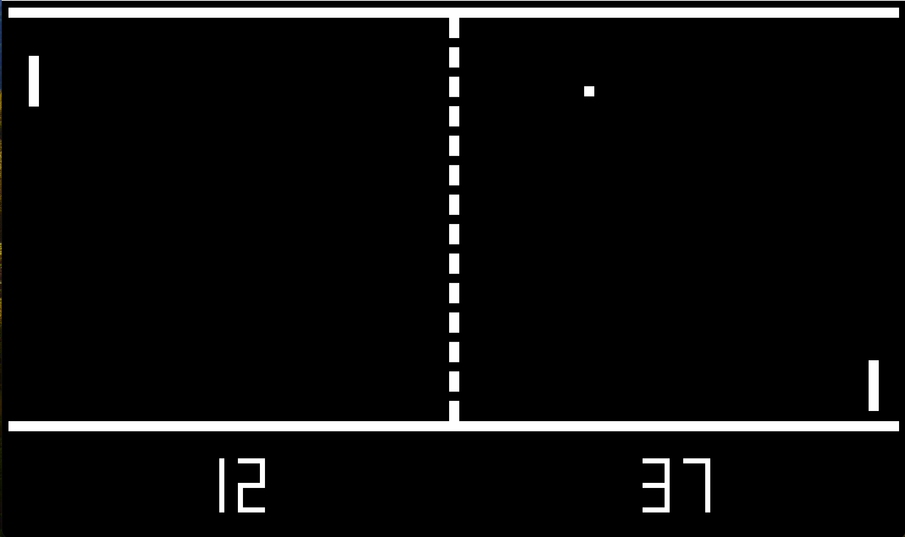
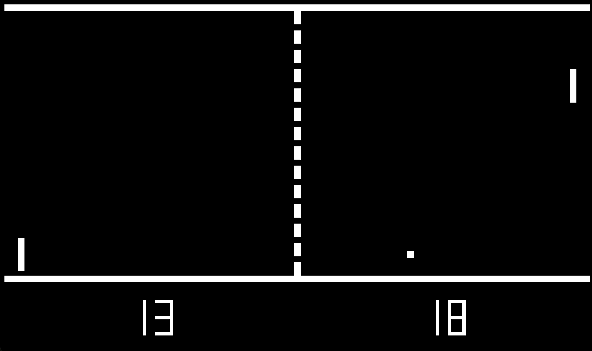
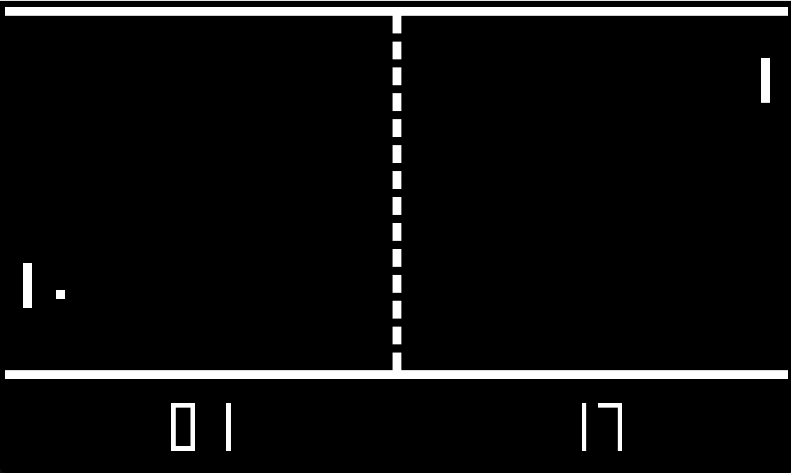

# Pong Clock
## A clock inspired by the game Pong

Pong, the TV video game, was released in 1972 by Atari. It was in instant success and soon was being played on living room television sets across America.

A ball is served up on a scene resembling table tennis action. The ball bounces back and forth between two paddles each guarding its side -- one paddle for the left player, and one for the right player.  A paddle slides up and down attempting to block the path of the ball and keep it in play.  If a paddle fails to get to the ball in time, the ball flies off the screen and a point is scored for the opposition.

In the normal game of Pong a player wins if they score 11 points.  But this version of Pong runs in "demo" mode. There is no human interaction.
 - Points do not stop at 11.
 - Instead, the score reflects the current time of day.

The player on the left is really bad: each minute the paddle "accidentally" misses the ball giving the other player a point.  The result of this miss: the points on the right increase by one to match the current minutes in the time of day.

The player on the right is much better, but not perfect.  This player misses the ball once every hour.  Thus advancing the score of the left player by one.  Reflecting the current hour in the day.

## Style 24 or AM/PM

### Default shows 24-hour Time

URL: PongClock.htm

By default the clock shows the time of day in 24-hour format.
  - Just after midnight the hours show "00".
  - In the afternoon the hours advance to 13, 14, .., 23

### Optional 12-hour (AM/PM) Time

Use the parameter "style=12" to enable AM/PM time.

URL: PongClock.htm?style=12

 - Just after midnight the hours show as "12"
 - In the afternoon the hours revert back to low numbers: 12, 1, 2, ... 11

